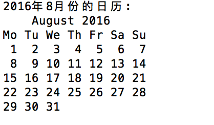
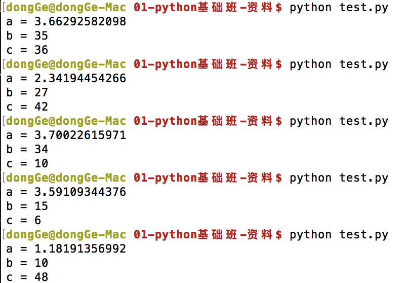

# 简单函数的使用

+ 函数简介

 所谓函数，就是指：把某些特定功能的代码组成为一个整体，这个整体就叫做函数

 


+ 函数定义和调用

 什么是函数的定义：相当于自己定义了一个能完成某些事件的功能；就好比自己打造了一个工具
 
 定义函数格式如下:
 ```python
 	
 	def test():
 		print '----哈哈----'
 		print '----这是我的第一个函数----'
 
 ```
 
 什么是函数调用：如果仅仅是定义了函数，其实是不能自动被执行的，必须要去调用它才可以；
 
 通俗的讲：定义函数相当于打造了一个工具，调用函数相当于使用这个工具完成想要做的事情

  ```python
 	
 	# 定义一个函数
 	def test():
 		print '----哈哈----'
 		print '----这是我的第一个函数----'

 	# 调用函数
 	test()
 
 ```

 **`Python之所以越来越受到开发者的喜爱，原因之一就是：它丰富的函数，基本上需要的功能Python都有了`**


+ 时间函数
 
 开发中，经常需要打印一些调试的信息，此时就又必须要输出时间，这就需要一些`时间函数`
 
 ```python
 
 	import time  # 引入time模块
 
 	currentTime = time.time()
 	print "当前时间戳为:", currentTime
 
 ```
 
 运行结果:
 ```python
 	当前时间戳为: 1465527332.44
 ```
 
 ```python
 	import time
 
 	localtime = time.localtime(time.time())
 	print "本地时间为 :", localtime
 ```
 
 运行结果:
 ```python
 	本地时间为 : time.struct_time(tm_year=2016, tm_mon=6, tm_mday=10, tm_hour=10, tm_ min=57, tm_sec=14, tm_wday=4, tm_yday=162, tm_isdst=0)
 ```

 ```python
 	import time
 
 	localtime = time.asctime( time.localtime(time.time()) )
 	print "本地时间为 :", localtime
 ```
 
 运行结果:
 ```python
 	本地时间为 : Fri Jun 10 10:58:53 2016
 ```


+ 日历函数

 ```python
 
 	import calendar
 
 	cal = calendar.month(2016, 8)
 	print "2016年8月份的日历:"
 	print cal;
 
 ```
 
 运行结果:
 
 


+ 随机数函数

 ```python
 	import random
 
 	a = random.uniform(1, 5)
 	print "a =",a
 
 	b = random.randint(10, 50)
 	print "b =",b
 
 	c = random.randrange(0, 51, 2)
 	print "c =",c
 ```

 运行结果:
 
 