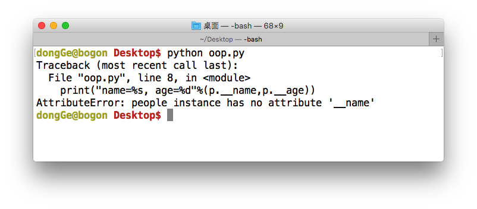

# 属性

在类中我们可以定义一些属性，比如：

```python
class people:
    name = 'Tom'
    age = 12

p = people()
print("name=%s, age=%d"%(p.name,p.age))

```

定义了一个people类，里面定义了name和age属性，默认值分别为'Tom'和12。

在定义了类之后，就可以用来产生实例化对象了，这句p = people( )实例化了一个对象p，然后就可以通过p来读取属性了。这里的name和age都是`公有`的，可以直接在类外通过对象名访问，如果想定义成`私有`的，则需在前面加2个下划线 即'__'

```python
class people:
    __name = 'Tom'
    __age = 12

p = people()
print("name=%s, age=%d"%(p.__name,p.__age))
```
　
这段程序运行会报错：




### 注意点：

提示找不到该属性，因为私有属性是不能够在类外通过对象名来进行访问的。在Python中没有像C++中public和private这些关键字来区别公有属性和私有属性，它是以属性命名方式来区分，如果在属性名前面加了2个下划线'__'，则表明该属性是私有属性，否则为公有属性（方法也是一样，方法名前面加了2个下划线的话表示该方法是私有的，否则为公有的）。