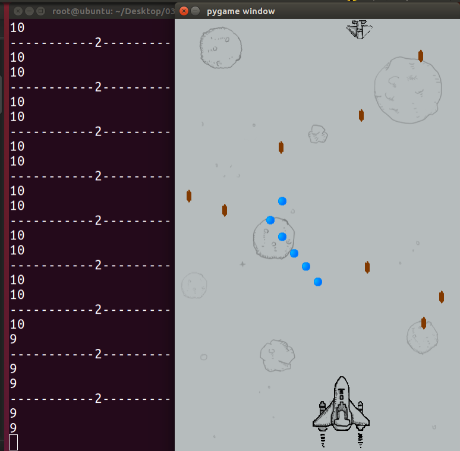

# 打飞机代码11：完成基本的功能



```python

#coding=utf-8

'''
	11. 基本成型
		1. 把在draw方法中的延时，提出来，放到while中
'''

import pygame

#导入按键的检测
from pygame.locals import *

import time

import random


#创建玩家的飞机类
class PlayerPlane(object):

	#初始化方法，完成飞机的默认设置
	def __init__(self, screen):
		
		#存储子弹列表
		self.bulletList = []
		
		#飞机图片
		planeImageName = './feiji/hero.gif'
		self.image = pygame.image.load(planeImageName).convert()

		#设置默认的坐标(左上角为(0,0))
		self.x = 230
		self.y = 600

		#设置速度
		self.speed = 5

		#设置飞机名字
		self.planeName = 'player'

		#用属性保存screen
		self.screen = screen


	#将飞机显示(画)出来
	def draw(self):
		self.screen.blit(self.image, (self.x, self.y))
		needRemoveList = []

		# print("-----------1---------")
		# print(len(self.bulletList))
		for tempBullet in self.bulletList:
			if tempBullet.judgeOut():
				needRemoveList.append(tempBullet)

		for tempRemove in needRemoveList:
			self.bulletList.remove(tempRemove)

		# print(len(self.bulletList))
		for tempBullet in self.bulletList:
			tempBullet.draw()


	#键盘按键的处理方法
	def keyHandle(self, keyValue):
		if keyValue=='left':
			print("--按下　左键--")
			self.x -= 20
		elif keyValue == 'right':
			print("--按下　右键--")
			self.x += 20
		elif keyValue == 'space':
			print("--按下　空格键--")
			#每次按下发射子弹，就创建一颗
			self.bulletList.append(Bullet(self.screen, self.planeName, self.x+40,self.y - 4))
		self.draw()

# 定义导弹类
class Bullet(object):

	#子弹类的初始化方法，完成当前子弹发射方向等设置
	def __init__(self, screen, planeName, x, y):

		#根据飞机的名字，来选择子弹的类型，即哪个飞机发射的
		#还要设置子弹飞行的方向
		if planeName == 'enemy':
			imageName = './feiji/bullet-1.gif'
			self.directioin = 'down'
		elif planeName == 'player':
			imageName = './feiji/bullet-3.gif'
			self.directioin = 'up'

		self.image = pygame.image.load(imageName).convert()
		self.x = x
		self.y = y

	def draw(self):
		screen.blit(self.image, (self.x, self.y))

	#判断是否超出屏幕范围
	def judgeOut(self):
		if self.directioin == 'down':
			self.y += 2
		elif self.directioin == 'up':
			self.y -= 2

		# 判断子弹是否移除屏幕，那么就要删除这个对象
		if self.y<1 or self.y>890:
			return True
		else:
			return False

# 定义敌人飞机类
class Enemy(object):

	def __init__(self, screen):

		#存储导弹列表
		self.bulletList = []

		#选择一个敌机的图片
		planeImageName = './feiji/enemy-1.gif'

		self.image = pygame.image.load(planeImageName).convert()

		self.x = 0
		self.y = 0
		self.directioin = "right" # right表示向右  left表示向左

		self.speed = random.randint(1,5)

		self.planeName = 'enemy'

		self.screen = screen

	def move(self):

		if self.directioin == "right":
			self.x += self.speed
		elif self.directioin == "left":
			self.x -= self.speed

		# 到达另外一个边界时，需要反转方向
		if self.x>480:
			self.directioin = "left"
		elif self.x<0:
			self.directioin = "right"

	def draw(self):
		self.screen.blit(self.image, (self.x, self.y))
		needRemoveList = []
		print("-----------2---------")
		print(len(self.bulletList))
		for tempBullet in self.bulletList:
			if tempBullet.judgeOut():
				needRemoveList.append(tempBullet)

		for tempRemove in needRemoveList:
			self.bulletList.remove(tempRemove)

		print(len(self.bulletList))
		for tempBullet in self.bulletList:
			tempBullet.draw()

	# 发射导弹
	def shoot(self):
		#随机生成１个数，如果在列表中，那么就发射，否则不发射
		shootFlagList = [2,6] 
		shootFlag = random.randint(1,100)
		if shootFlag in shootFlagList:
			self.bulletList.append(Bullet(self.screen, self.planeName,self.x,self.y))


if __name__ == '__main__':

	screen = pygame.display.set_mode((480,890),0,32)

	bgImageFile = './feiji/background.png'

	background = pygame.image.load(bgImageFile).convert()


	#创建玩家对象
	player = PlayerPlane(screen)

	#创建敌机对象
	enemy = Enemy(screen)

	while True:
		screen.blit(background,(0,0))

		#判断是否是点击了退出按钮
		for event in pygame.event.get():
			# print(event.type)
			if event.type == QUIT:
				print("exit")
				exit()
			elif event.type == KEYDOWN:
				if event.key == K_a or event.key == K_LEFT:
					print('left')
					player.keyHandle('left')

				
				elif event.key == K_d or event.key == K_RIGHT:
					print('right')
					player.keyHandle('right')

				elif event.key == K_SPACE:
					print('space')
					player.keyHandle('space')


		player.draw()
		enemy.move()
		enemy.shoot()
		enemy.draw()


		pygame.display.update()

		time.sleep(0.01)

```