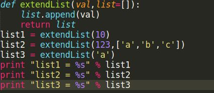

1. 在 Python 中,类和对象有什么区别?对象如何访问类的方法? 创建一个对象时做了什么?
2. 请写出一段 Python 代码实现分组一个 list 里面的元素,比如 [1,2,3,...100]变成 [[1,2,3],[4,5,6]....]
3. 请写出一段 Python 代码实现删除一个 list 里面的重复元素
4. 设计实现遍历目录与子目录,抓取.pyc 文件
5. 写出一个函数,给定参数 n,生成含有 n 个元素值为 1~n 的数 组,元素顺序随机,但值不重复
6. 在不用其他变量的情况下，交换a、b变量的值
7. 如何在一个 function 里设置一个全局变量
8. 请问如下代码会输出什么？

 